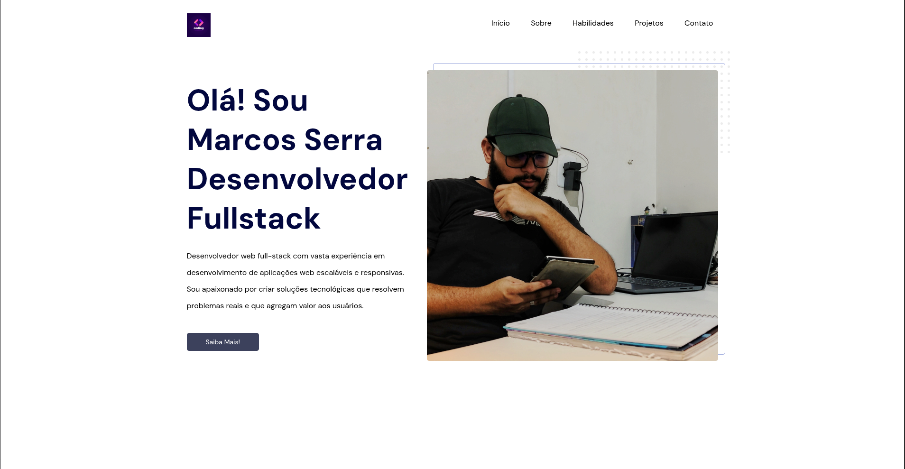

# Portfólio Marcos Serra

Este é o repositório do meu portfólio profissional, desenvolvido para apresentar minhas habilidades, projetos e formas de contato.

## 📁 Estrutura do Projeto

```
.
├── index.html
├── css/
│   ├── extends.css
│   ├── globals.css
│   ├── variables.css
│   └── components/
│       ├── about.css
│       ├── footer.css
│       ├── header.css
│       ├── navbar.css
│       ├── projects.css
│       └── skills.css
├── scripts/
│   └── index.js
├── assets/
│   ├── abstract.svg
│   ├── colors.png
│   ├── delivery.png
│   ├── ecommerce.png
│   ├── facebook.svg
│   ├── files.png
│   ├── instagram.svg
│   ├── linkedin.svg
│   ├── logo.svg
│   ├── logoM.svg
│   ├── marcos-gusmao.webp
│   ├── menu.svg
│   ├── notebook.png
│   └── phone.png
└── .vscode/
    └── settings.json
```

## 🛠️ Tecnologias Utilizadas

- **HTML5**: Estruturação da página.
- **CSS3**: Estilização, organização por componentes e uso de variáveis.
  - CSS Modularizado: cada seção possui seu próprio arquivo em `css/components/`.
  - Responsividade com media queries.
  - Variáveis CSS para cores e fontes em [`css/variables.css`](css/variables.css).
- **JavaScript Vanilla**: Interatividade do menu mobile e efeito de scroll na navbar ([`scripts/index.js`](scripts/index.js)).
- **Imagens e SVGs**: Ícones, fotos e ilustrações em [`assets/`](assets/).
- **Google Fonts**: Fonte DM Sans importada via CDN.
- **Live Server**: Configuração para desenvolvimento local em `.vscode/settings.json`.

## ✨ Funcionalidades

- **Navbar Fixa e Responsiva**: Adapta-se para mobile com menu hamburguer.
- **Seções**:
  - Início (Header)
  - Sobre
  - Habilidades
  - Projetos
  - Contato (Footer)
- **Projetos em Destaque**: Lista de projetos com imagens e descrições.
- **Links para Redes Sociais**: Instagram e LinkedIn.
- **Design Responsivo**: Layout adaptável para diferentes tamanhos de tela.
- **Scroll Suave**: Navegação suave entre as seções.

## 🚀 Como rodar o projeto

1. Clone o repositório:
   ```sh
   git clone https://github.com/seu-usuario/seu-repo.git
   ```
2. Abra a pasta no VS Code.
3. Utilize a extensão **Live Server** para rodar localmente (porta configurada: 5501).
4. Acesse `http://localhost:5501` no navegador.

## 📷 Screenshots



## 📄 Licença

Este projeto é de uso pessoal e para fins de portfólio.

---

Desenvolvido por [Marcos Serra](https://www.linkedin.com/in/marcosserra1/)